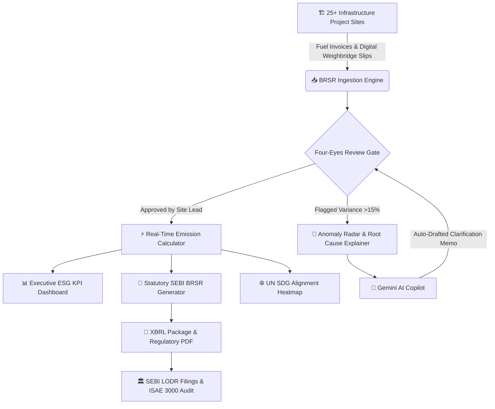

# ⚡ MEIL ESG CONNECT ⚡
### *Next-Gen Enterprise Carbon Accounting & SEBI BRSR Core Reporting Suite* 🚀

[](https://www.sebi.gov.in)
[](https://react.dev)
[](https://ai.google.dev)
[](https://meil.in)

> **"Zero Greenwashing. Pure Telemetry. Certified Net-Zero Trajectory."**  
> MEIL ESG Connect is an enterprise B2B SaaS platform engineered for **Megha Engineering & Infrastructures Ltd (MEIL)** to streamline statutory **SEBI BRSR (Business Responsibility and Sustainability Reporting)** filings, Scope 1/2/3 GHG accounting, physical weighbridge evidence provenance, and multi-tier ISAE 3000 assurance workflows.

---

## 🌟 The Vibe Check (TL;DR)

Managing statutory disclosures for 25+ mega civil projects (Zojila Tunnel, Polavaram Dam, Kaleshwaram Pump House, Mongol Refinery) used to mean messy WhatsApp slips, broken spreadsheets, and endless audit panic. 

**MEIL ESG Connect fixed that:**
- 🛡️ **Four-Eyes Approval Workflow** with tamper-proof audit trails (ISAE 3000 ready).
- ⚖️ **Signed Weighbridge & Gate Pass Challan Viewer** with digital stamps & QR verification.
- ⚡ **Real-Time Emission Engine** applying DEFRA 2024 & CEA Baseline v20 grid factors.
- 🧠 **Multi-Model Gemini Copilot** generating statutory BRSR narratives, diagnosing fuel variance anomalies, and auditing compliance gaps in seconds.

---

## 🏗️ System Architecture



---

## 💎 Killer Features

### 1. 📊 Executive ESG Mission Control
- **Scope 1, 2 & 3 Real-Time Accounting:** Live tracking of metric tonnes $CO_2e$ categorized by heavy diesel earthmoving fleet, captive DG sets, CEA grid power, and upstream blast-furnace slag cement blends.
- **BRSR Core 9 Intensities:** Auto-computes GHG intensity per ₹ Crore turnover ($tCO_2e / ₹\text{ Cr}$) and water recycling percentage.
- **Interactive Infrastructure GIS Map:** Real-time geospatial telemetry across all national & international project clusters.
- **SDG Alignment Matrix:** Direct tracking against UN Sustainable Development Goals (SDG 6 Water, SDG 7 Clean Energy, SDG 9 Industry & Innovation, SDG 13 Climate Action).

### 2. 📝 Data Ingestion & Signed Weighbridge Provenance
- **Section A, B & C BRSR Core Forms:** Fully compliant with circular *SEBI/HO/CFD/CFD-SEC-2/P/CIR/2023/122*.
- **Project Quick-Entry Tabular Sheet:** Rapid logbook entry for site engineers.
- **Official Signed Weighbridge Modal:** Click to view digital gate pass challans featuring the official MEIL corporate emblem, vehicle telemetry, tare/gross weight splits, lab quality stamps, and instant Scope 1 GHG emission math.

### 3. 🔍 Assurance, Compliance & Four-Eyes Workflow
- **Multi-Role Context Simulator:** Switch dynamically between:
  - 👑 *Group ESG Admin*
  - 🏢 *Subsidiary Approver*
  - 📋 *Business Unit Reviewer*
  - 👷 *Project Data Entry User*
  - 🛡️ *Independent Auditor (ISAE 3000)*
  - 👔 *Board Viewer*
- **Immutable Chronological Audit Trail:** Captures User, Action, Entity, Field modified, Old Value, New Value, Timestamp, and IP.
- **One-Click Regulatory Report Generator:** Live preview with printable SEBI BRSR Core documentation and XBRL export format.

### 4. 🧠 Autonomous AI ESG Copilot (Powered by Gemini)
- **Draft Statutory Narratives:** Converts raw monthly consumption logs into executive statements formatted for regulatory board reports.
- **Anomaly Explainer & Site Query Notice:** Identifies sudden $>15\%$ month-over-month fuel variance and drafts official audit clarification notices to Site In-Charges.
- **SEBI Gap Analysis:** Audits uploaded data completeness against all mandatory BRSR Core attributes.
- **Ask ESG Chat:** Grounded conversational assistant trained on MEIL project data and CEA/DEFRA emission factors.

---

## 🛠️ Tech Stack & Goodies

| Layer | Technologies |
| :--- | :--- |
| **Frontend Framework** | React 19, TypeScript, Vite 8, Tailwind CSS v4 |
| **UI Components & Icons** | Custom Glassmorphic Enterprise Design, Lucide Icons, Motion |
| **Backend & Routing** | Express.js, TypeScript Execution (tsx), Vite Middleware |
| **AI / LLM Engine** | `@google/genai` SDK with Multi-Model Fallback (`gemini-3.5-flash`, `gemini-3.8-flash`, `gemini-flash-latest`) |
| **Compliance Standards** | SEBI BRSR Core, ISAE 3000, GHG Protocol, CEA Baseline v20, DEFRA 2024 |

---

## 🚀 Quick Start (Run Locally)

### Prerequisites
- Node.js (v18+ recommended)
- npm or pnpm

### 1. Clone & Navigate
```bash
git clone https://github.com/namanacharya17197-ui/meil.2.git
cd meil.2
```

### 2. Install Dependencies
```bash
npm install --legacy-peer-deps
```

### 3. Configure API Key
Create a `.env` file in the root directory:
```env
GEMINI_API_KEY="your_google_gemini_api_key_here"
```

### 4. Fire Up the Dev Server
```bash
npm run dev
```

Open your browser at:
👉 **`http://localhost:3000`**

---

## 📂 Project Structure

```bash
meil.2/
├── src/
│   ├── components/
│   │   ├── common/              # Header, Sidebar, MeilLogo, GuidedTour, GatewayModal
│   │   └── modules/
│   │       ├── overview/        # Executive Dashboard, GIS Map, SDG Heatmap, Landing
│   │       ├── governance/      # Org Hierarchy Tree, Submission Progress Matrix
│   │       ├── collection/      # BRSR Sections A/B/C, Quick Entry, Signed Weighbridge Modal
│   │       ├── analytics/       # Emission Calculator, BRSR Core Intensities, Anomaly Radar
│   │       ├── assurance/       # Four-Eyes Approvals, Audit Trail, Regulatory PDF Generator
│   │       ├── copilot/         # AI Narrative Synthesis, Anomaly Explainer, Gap Audit, Chat
│   │       └── admin/           # Emission Factor Library Master, Indicator Dictionary
│   ├── context/
│   │   └── EsgContext.tsx       # Global multi-site & role state management
│   ├── data/
│   │   └── mockData.ts          # 25+ real infrastructure projects, emission factors & history
│   ├── types/
│   │   └── esg.ts               # Complete TypeScript interfaces for ESG telemetry
│   ├── App.tsx                  # Modular tab routing & container
│   ├── index.css                # Tailwind CSS v4 theme variables
│   └── main.tsx                 # Root DOM entry point
├── server.ts                    # Full-stack Express server with Gemini AI endpoints
├── package.json
├── tsconfig.json
├── vite.config.ts
├── WORKFLOW.md                  # Comprehensive operational workflow guide
├── DESIGN.md                    # Enterprise design system & tokens
└── PRD.md                       # Product Requirements Document
```

---

## 📜 Regulatory Citations & Compliance
- **SEBI Circular:** `SEBI/HO/CFD/CFD-SEC-2/P/CIR/2023/122` (BRSR Core Assurance Mandate)
- **Central Electricity Authority (CEA):** CO₂ Baseline Database for the Indian Power Sector (v20)
- **DEFRA UK Government GHG Conversion Factors:** 2024 Technical Standards
- **ISAE 3000 (Revised):** Assurance Engagements Other Than Audits or Reviews of Historical Financial Information

---

## 🤝 Contributing & License
Built with ❤️ for **Megha Engineering & Infrastructures Ltd (MEIL)**.  
Licensed under the Apache-2.0 License.