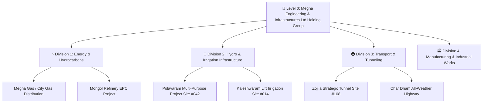
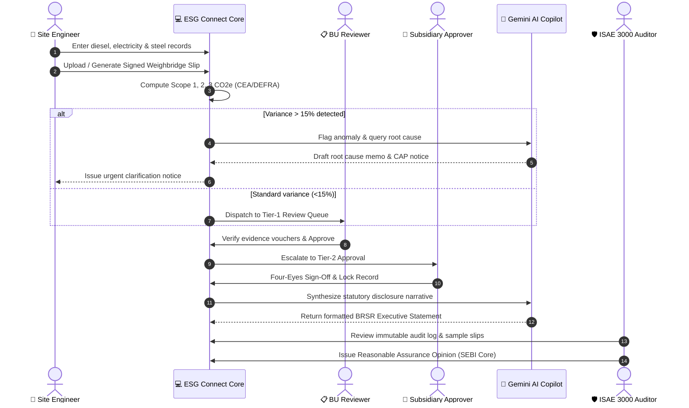
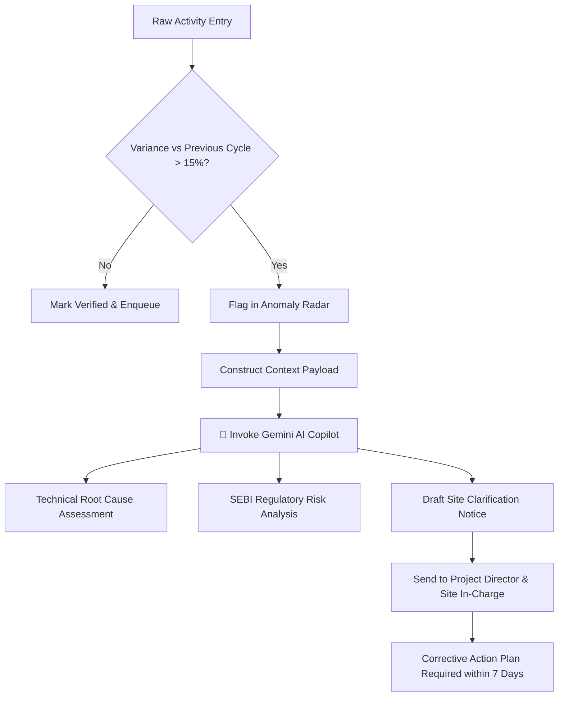

# 🔄 MEIL ESG Connect — Operational Workflows & Lifecycle Architecture

> **Document Version:** 2.4.0  
> **Target Framework:** SEBI BRSR Core (Regulation 34 LODR) · ISAE 3000 Reasonable Assurance Standard  
> **Classification:** Enterprise Operational Architecture

---

## 📑 Table of Contents
1. [Overview & Governance Hierarchy](#1-overview--governance-hierarchy)
2. [Role Matrix & Access Control (RBAC)](#2-role-matrix--access-control-rbac)
3. [End-to-End ESG Reporting Lifecycle](#3-end-to-end-esg-reporting-lifecycle)
4. [Data Ingestion & Physical Evidence Provenance](#4-data-ingestion--physical-evidence-provenance)
5. [Real-Time Carbon Accounting & Emission Computation](#5-real-time-carbon-accounting--emission-computation)
6. [Automated Anomaly Radar & AI Diagnostic Loop](#6-automated-anomaly-radar--ai-diagnostic-loop)
7. [Four-Eyes Review & Approval Workflow](#7-four-eyes-review--approval-workflow)
8. [Statutory SEBI BRSR Generation & Audit Vault](#8-statutory-sebi-brsr-generation--audit-vault)

---

## 1. Overview & Governance Hierarchy

MEIL ESG Connect models the conglomerate's complex multi-tier organizational structure across four distinct tiers:

Each project site functions as an autonomous data collection unit with its own digital logbooks, fuel dispensing telemetry, and weighbridge gate vouchers.

---

## 2. Role Matrix & Access Control (RBAC)

The platform enforces strict separation of duties (SoD) to satisfy ISAE 3000 independent assurance standards:

| Role Persona | Ingestion / Edit | Anomaly Review | Four-Eyes Approval | AI Executive Narrative | Regulatory Sign-off |
| :--- | :---: | :---: | :---: | :---: | :---: |
| **Project Data Entry User** | ✅ Yes | 👁️ View Only | ❌ No | ❌ No | ❌ No |
| **Business Unit Reviewer** | ✏️ Annotate | ✅ Diagnose | 🟡 Tier-1 Pass | 👁️ View Only | ❌ No |
| **Subsidiary Approver** | ❌ No | ✅ Mitigate | 🟢 Tier-2 Pass | ✏️ Generate Draft | ❌ No |
| **Group ESG Admin** | ⚙️ Config Masters | ✅ Full Access | 🟣 Final Group Pass | 🚀 Full AI Copilot | ✍️ Statutory Sign |
| **Independent Auditor (ISAE 3000)** | ❌ No | 🔍 Audit Mode | 📜 Issue Assurance Cert | 🔍 Verification Chat | 🔍 Sample Verification |
| **Board Viewer** | 👁️ Read-Only | 👁️ Read-Only | 👁️ Read-Only | 👁️ Executive View | 👁️ Read-Only |

---

## 3. End-to-End ESG Reporting Lifecycle

---

## 4. Data Ingestion & Physical Evidence Provenance

### The Weighbridge Slip Verification Protocol
In heavy infrastructure works (e.g. tunnel excavation, mass concrete batching), **diesel fuel and raw materials constitute >80% of Scope 1 and Scope 3 footprints**. 

MEIL ESG Connect enforces physical slip provenance:
1. **Gross / Tare / Net Telemetry:** Automatic extraction of vehicle gross weight, tare weight, and net delivered fuel/aggregate quantity.
2. **Quality Stamp Certification:** Verification of sulfur content (BS-VI diesel standard) or slag blend proportion.
3. **Automated Carbon Footprint Ingestion:**
   $$\text{Scope 1 Fuel Emission } (tCO_2e) = \text{Net Quantity (L)} \times 2.68787 \times 10^{-3}$$
4. **Permanent Digital Voucher:** Stored in the tamper-proof Assurance Vault with clickable modal access across the entire reporting trail.

---

## 5. Real-Time Carbon Accounting & Emission Computation

The platform calculates carbon and intensity figures dynamically:

### Formulae & Factor Masters
- **Scope 1 (Direct Fuel):**
  $$\text{Scope 1} = \sum (\text{Fuel Volume} \times \text{DEFRA Fuel Factor})$$
- **Scope 2 (Grid Electricity - Location Based):**
  $$\text{Scope 2} = \text{Grid kWh} \times 0.716 \text{ kg } CO_2e/\text{kWh (CEA v20 Baseline)}$$
- **Scope 2 (Market Based):**
  $$\text{Scope 2 (Market)} = (\text{Grid kWh} - \text{Green Open Access kWh}) \times 0.716$$
- **Turnover GHG Intensity (SEBI BRSR Attribute 1):**
  $$\text{GHG Intensity} = \frac{\text{Scope 1 } (tCO_2e) + \text{Scope 2 } (tCO_2e)}{\text{Turnover in ₹ Crores}}$$
- **Water Recycling Ratio (SEBI BRSR Attribute 4):**
  $$\text{Water Recycled \%} = \frac{\text{Volume Recycled \& Reused (kL)}}{\text{Total Fresh Water Withdrawn (kL)}} \times 100$$

---

## 6. Automated Anomaly Radar & AI Diagnostic Loop

---

## 7. Four-Eyes Review & Approval Workflow

The platform provides an actionable kanban/table interface for Approvers:
- **Accept & Stamp:** Validates the quantitative figure and associated weighbridge slip, locking the record against further edits.
- **Request Clarification:** Generates an inline thread back to the site engineer requesting meter calibration certificates or delivery challans.
- **Reject & Purge:** Rejects fraudulent or duplicated records with mandatory audit justification notes.
- **Audit Trail Immutability:** Every interaction is written to the cryptographic audit ledger containing:
  - User ID & Full Name
  - Timestamp (UTC & IST)
  - IP Address
  - Before/After Value Snapshot

---

## 8. Statutory SEBI BRSR Generation & Audit Vault

At the culmination of each reporting cycle:
1. **Aggregated Matrix Compilation:** All approved site data aggregates to Division and Group Apex levels.
2. **AI Director Narrative Synthesis:** Gemini analyzes annual variances to draft statutory commentary for Section C disclosures.
3. **XBRL Package Generation:** Data maps into MCA/SEBI-compliant XBRL taxonomy tags.
4. **PDF Statutory Filing Preview:** Produces the official SEBI BRSR report formatted for direct annexure to MEIL's Annual Integrated Report.
